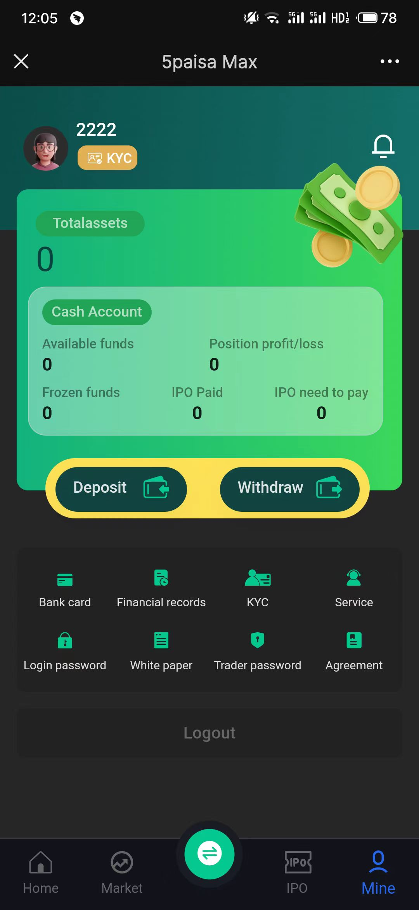

# Stock Exchange

## 项目简介

Stock Exchange 是一个基于 **Spring Boot** 和 **Vue.js** 构建的印度股票交易系统。该系统旨在为用户提供实时的股票市场数据、股票列表、实时K线图、IPO新股信息、大宗交易数据以及相关新闻列表。

## 项目特点

- **实时数据**：系统通过对接实时数据源，确保股票行情、K线图等数据的实时更新。
- **股票列表**：提供全面的股票列表，支持按行业、市值、涨跌幅等多种条件筛选。
- **实时K线图**：基于实时数据生成K线图，支持多种时间周期（如1分钟、5分钟、日K、周K等）。
- **IPO新股信息**：实时更新新股上市信息，包括发行价、发行量、申购日期等。
- **大宗交易**：提供大宗交易数据，帮助用户了解大额交易的市场动态。
- **新闻列表**：整合股票市场相关新闻，帮助用户及时获取市场动态和公司公告。

## 技术栈

### 后端技术栈
- **Spring Boot**：用于构建后端服务，提供RESTful API接口。
- **Mybatis**：用于数据库操作，简化数据访问层开发。
- **MySQL**：作为主要的关系型数据库，存储股票数据、用户信息等。
- **Redis**：用于缓存实时数据，提高系统响应速度。
- **WebSocket**：用于实现实时数据推送，确保前端能够实时获取最新的股票行情。
- **PowerJob**：用于定时任务调度，如定时更新股票数据、新闻等。

### 前端技术栈
- **Vue.js**：用于构建用户界面，提供响应式的单页应用体验。
- **Vuex**：用于状态管理，确保数据在组件间的共享和同步。
- **Vue Router**：用于前端路由管理，支持页面跳转和嵌套路由。
- **Axios**：用于与后端API进行HTTP通信，获取和提交数据。
- **ECharts**：用于绘制实时K线图、股票走势图等可视化图表。
- **Element UI**：提供丰富的UI组件，简化前端开发。

## 功能模块

### 1. 股票列表
- 展示所有股票的实时行情数据，包括股票代码、名称、当前价格、涨跌幅、成交量等。
- 支持按行业、市值、涨跌幅等条件进行筛选和排序。

### 2. 实时K线图
- 提供实时K线图展示，支持多种时间周期切换（如1分钟、5分钟、日K、周K等）。
- 支持技术指标（如MA、MACD、RSI等）的叠加显示。

### 3. IPO新股信息
- 展示即将上市或已上市的新股信息，包括发行价、发行量、申购日期、中签率等。
- 提供新股申购的相关公告和提示。

### 4. 大宗交易
- 展示大宗交易数据，包括交易时间、交易价格、交易量、买卖双方信息等。
- 支持按股票代码、交易日期等条件进行筛选。

### 5. 新闻列表
- 整合股票市场相关新闻，包括公司公告、行业动态、政策解读等。
- 支持按股票代码、新闻类型等条件进行筛选。

## 项目截图

### 股票列表

### 新闻列表

### 股票列表

### 实时K线图

### 用户信息

## 联系方式

如果有演示或者购买需求，欢迎联系：

- 官网：[stocktv.top@outlook.com](https://pao.stocktv.top/)
- Telegram: https://t.me/stocktvpaopao
